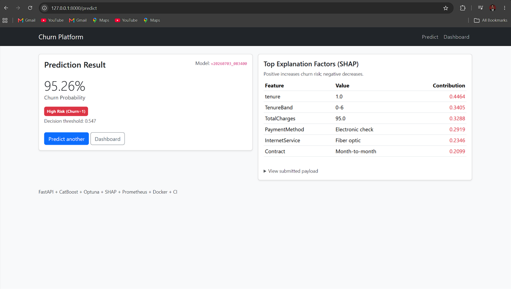
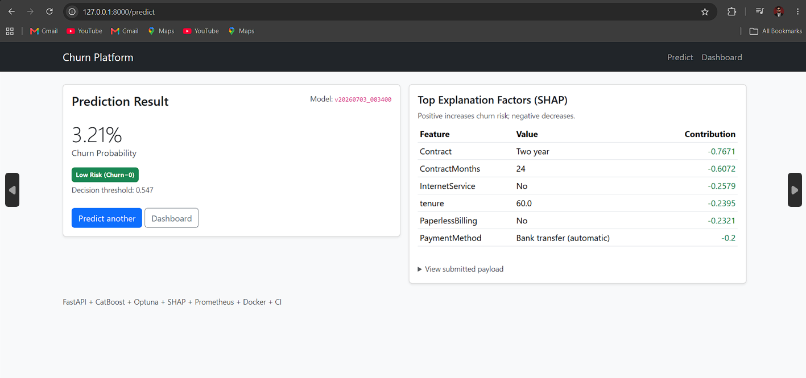

# AI‑Powered Customer Churn Prediction & Business Intelligence Platform

End‑to‑end **customer churn prediction** + **BI dashboard** web app built with **FastAPI** and **CatBoost**, including **SHAP explainability**, **model versioning**, **monitoring (Prometheus)**, and **real‑time inference (WebSocket)**.

## Live Demo
- (Add your Render link here after deployment)
- Example: https://customer-churn-bi-platform.onrender.com

## Repository
- https://github.com/Dhipin1/customer-churn-bi-platform

---

## Key Features
- **Churn Prediction Model**: CatBoost classifier (+ Optuna hyperparameter tuning)
- **Explainability**: SHAP feature contributions per prediction (CatBoost built‑in)
- **Web App (No Streamlit)**: FastAPI + Jinja2 + Bootstrap UI
- **BI Dashboard**: Plotly charts (distribution, churn rate by segments, tenure bands, etc.)
- **Logging**: Stores predictions to **SQLite**
- **Model Versioning**: Each training run saved as a new version; supports switching active model
- **Monitoring**: Prometheus metrics endpoint + JSON logs
- **Real‑Time Inference**: WebSocket prediction endpoint
- **MLOps/DevOps**: Docker + docker-compose + GitHub Actions CI

---

## Tech Stack
- **Backend**: FastAPI, Uvicorn, Pydantic, Jinja2
- **ML**: CatBoost, Optuna, Scikit-learn, Pandas, NumPy
- **Explainability**: SHAP (via CatBoost)
- **Dashboard**: Plotly
- **Storage**: SQLite
- **Monitoring**: prometheus-client
- **DevOps**: Docker, GitHub Actions

---

## Screenshots

### Prediction Form

### Prediction Results

### Dashboard (additional screenshots)
> These filenames contain spaces, so links must use URL encoding (`%20`). The `` tags below already do that.

---

## Project Structure (High Level)